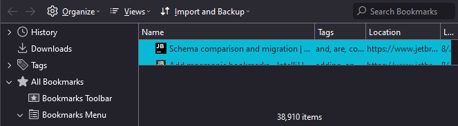
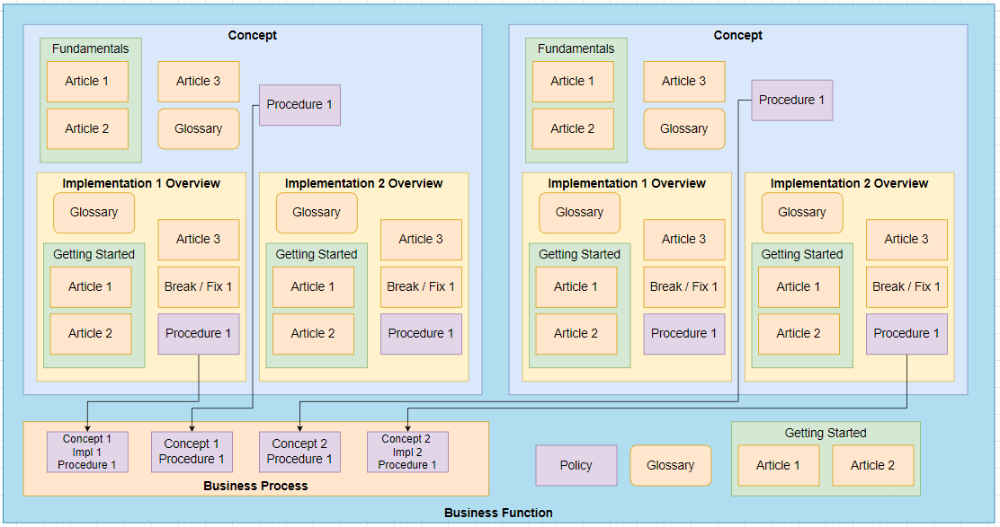
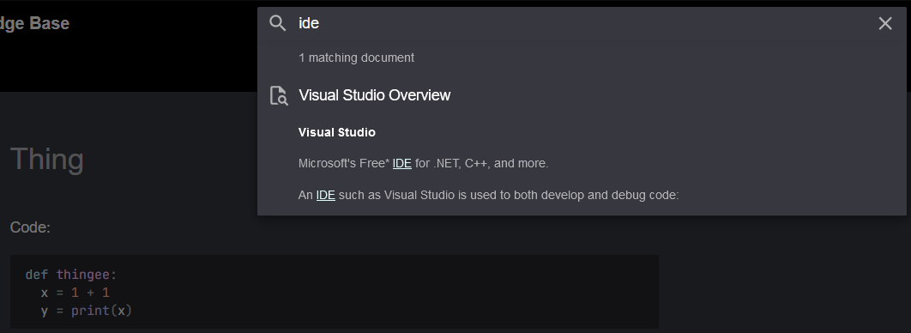

# What is edshelton.org?

It's my documentation & teaching testing site!

My old system of tagging bookmarks got out of hand:

***Only 38,910 different bookmarks!***

I couldn't effectively share data without being there, which doesn't scale!

# My Background

I took a job where ***no one had IT experience.***
  &nbsp;&nbsp;&nbsp;&nbsp;&nbsp;&nbsp;&nbsp;&nbsp;
It had **high turnover**, **no documentation**, and **dysfunctional communication!**

On top of that, ***I also became responsible for training new IT staff!***

To my surprise, I found **a deep appreciation for documenting!**

# Pitfalls

After implementing a "real" documentation system with 1500+ articles, trainees *still had issues with:*

1. The big picture.
1. Necessary background information.
1. Where to start.
1. Keeping data fresh.

These basic needs are both valuable and very tricky!

# My Answer

I've attempted to address these issues by breaking information into key units:

| *Unit*                                                                             | *What*                                                                      |
| ---------------------------------------------------------------------------------- | ---------------------------------------------------------------------------------- |
| [***Article: Glossary***](.foam/templates/article-glossary-template.md)            | Explaining key terms, low-risk-of-change info, and relevant links.                 |
| [***Article: Guide***](.foam/templates/article-guide-template.md)                  | How to perform something, use a feature, or learn a concept.                       |
| [***Article: Issue and QA***](.foam/templates/article-issue-and-qa-template.md)    | Offers an alternative way to discover articles to fix issues or understand better. |
| [***Article: Procedure***](.foam/templates/article-procedure-template.md)          | An ordered list of manuals w/ extra business logic between to perform a process.   |
| [***Concept***](.foam/templates/concept-template.md)                               | An overview & "start here" of a concept, like "Programming".                       |
| [***Concept Implementation***](.foam/templates/implementation-concept-template.md) | An overview & "start here" of a concrete solution, like "Python".                  |
| [***Context / Change***](.foam/templates/context-or-change-template.md)            | Tracking changes or background context of a subject or process.                    |

By linking these units together, you can begin building valuable & discoverable documentation.

This is roughly how I build it, with many units linked between each other in modular fashion.

Check the Code or Raw view on Github since much of it is commented by default:

# How I Implement It

I use `mkdocs` as a static-site-generator, and link using `Foam` w/ VSCode.
          &nbsp;&nbsp;&nbsp;&nbsp;&nbsp;&nbsp;&nbsp;&nbsp;
        `mkdocs-material` & `mkdocs` create a familiar navigation experience.
          &nbsp;&nbsp;&nbsp;&nbsp;&nbsp;&nbsp;&nbsp;&nbsp;
        `foam` creates an always-up-to-date linkage system, allows easy linking.
          &nbsp;&nbsp;&nbsp;&nbsp;&nbsp;&nbsp;&nbsp;&nbsp;
        `mkdocs-roamlinks` allows `foam` markdown linking to carry over to `mkdocs`.

This system is great for a few reasons:

1. Keeps everything plaintext and under source control.
2. Easily put under CI, just edit the text, push, and edit is live!
3. Super easy to host anywhere, just copy the `./sites` artifact to any web server.
4. Fully featured fuzzy search engine.
5. [Lots of](https://squidfunk.github.io/mkdocs-material/setup/)
cool [features](https://squidfunk.github.io/mkdocs-material/reference/code-blocks/)
and lots of [plugins](https://github.com/mkdocs/catalog)
that extend `mkdocs`.

An example of the search engine, its amazingly fast and provides good context.

Shoot me a message & I'll make a how-to-get-started guide to build this implementation.

# How You Can Implement It

You can easily adapt my templates into any platform's templates.

For work, consider your team's skill level & friction tolerance:
- Microsoft OneNote (Simplest one & free if using Office 365)
- Bookstack (More advanced features, can share easier)

For personal, anything you're comfortable in will work.

# Influences

The system is slightly influenced by
[Zettelkasten](https://zettelkasten.de/posts/overview/)
and [Molecular](https://reasonabledeviations.com/2022/04/18/molecular-notes-part-1/)
note-taking systems.

# Licenses

My templates are `CC0`.
 Please use them as you see fit.

My page content is `CC BY-SA 4.0`.
 They will be explicitly marked at the bottom, just credit me!

The software used for this implementation is respectively licensed by their authors.
