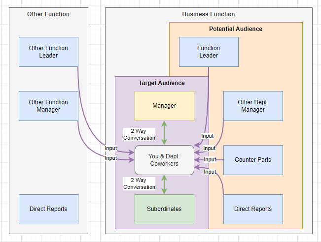

# Ed's Knowledge System

My evolving system for keeping track of everything technical.

# Are You Me?

Need to remember some link? No issue, let's search my bookmark!

This is ***only one folder of many!***

Need my documentation? No problem!

> *Just* `cd` *to our SharePoint and* `find . -iname *IMPORTANT*` *and simply* `grep -inr blahblahblah`

> *...wait, why do you have a big rock? AH!!*

To a more novice me, all this made sense!

# The Issue

I took a job where ***no one had IT experience.***
  &nbsp;&nbsp;&nbsp;&nbsp;&nbsp;&nbsp;&nbsp;&nbsp;
It had **high turnover**, **no documentation**, and **dysfunctional communication!**

On top of that, ***I also became responsible for training new IT staff*** on top of my normal job.

To my surprise, I actually found a **profound interest in training others!**

# Hard Lessons

My old note taking system <u>*was not scalable to a team*</u>.

After implementing a real documentation system with 1500+ articles, trainees *still had issues with:*

1. Where to find the information **inside the existing documentation system.**
1. What prerequisite knowledge is required before attempting.
1. Why things worked the way they did in a procedure.
1. How to <u>formally complete a business process</u>.
1. How to resolve contradictory information.
1. When to reach for assistance, and who they are.

While these sound obvious, they require discipline and planning to both document and train.

# Scope & What This Doesn't Solve

This system is meant to be used by <u>your department **only!**</u>

This system **doesn't directly fix people problems.**

Nothing will, besides your department becoming more mature and proactive.

# The System

The system is infinitely scalable, using these fundamental units:

| *Unit*                                                                             | *Explanation*                                                                      |
| ---------------------------------------------------------------------------------- | ---------------------------------------------------------------------------------- |
| [***Article: Glossary***](.foam/templates/article-glossary-template.md)            | Explaining key terms, low-risk-of-change info, and relevant links.                 |
| [***Article: Guide***](.foam/templates/article-guide-template.md)                  | How to perform something, use a feature, or learn a concept.                       |
| [***Article: Issue and QA***](.foam/templates/article-issue-and-qa-template.md)    | Offers an alternative way to discover articles to fix issues or understand better. |
| [***Article: Procedure***](.foam/templates/article-procedure-template.md)          | An ordered list of manuals w/ extra business logic between to perform a process.   |
| [***Concept Implementation***](.foam/templates/implementation-concept-template.md) | An overview & "start here" of a concrete solution, like "Python".                  |
| [***Concept***](.foam/templates/concept-template.md)                               | An overview & "start here" of a concept, like "Programming".                       |

Using these templated units (found in `.foam/templates`) you too can make this system.

Check the Code or Raw view on Github since much of it is commented by default:

# Writing for Success

These principles will keep your documents fresh and readers happy:

| *Tip*                          | *Explanation*                                                                   |
| ------------------------------ | ------------------------------------------------------------------------------- |
| ***Start From Zero***          | Assume the reader wants to learn but may not know much.
| ***Focus on the Atomic***      | Examine what doesn't change first and isolate that. Start with a glossary.       |
| ***Don't Repeat Yourself***    | *Avoid explaining things twice as best as possible!* Use links.|
| ***Keep it Simple***           | Explain the spirit, give an example, and link the full references.              |
| ***Pictures & Visual Breaks*** | Chunk text and visually split it with markup, tables, and pictures.             |

# My Working Example

Here's a visualization:

Don't worry, this is just how I use it!

You'll notice some simple abstractions of base units:

| *Unit*                  | *Explanation*                                                 |
| ----------------------- | ------------------------------------------------------------- |
| ***Business Process***  | Just a `Procedure` at a higher conceptual level.              |
| ***Policy***            | Just a `Glossary` related to business policy.                 |
| ***Business Function*** | Just a `Concept Implementation` at a higher conceptual level. |

Feel free to create concrete names to my abstract templates.

# Success

I've had great success modeling business IT knowledge systems this way.

This system has enabled our team to have:

- Consistency.
- Simplified staff onboarding.
- Measurable scope during process changes.
- Reduction in single-person dependencies & constraints.
- Stronger communication between departments, functions, and leadership.

In conjunction with an internal Kanban and retrospectives, we've seen huge department gains!

This is the IT department now  ...in our dreams! 

# Okay Show Me An Example

You're in luck!

My knowledge base https://edshelton.org is made using this system.

**NOTE:** You'll see its an imperfect implementation, this is how the world is!

# How I Implement It

I use `mkdocs` as a static-site-generator, and link using `Foam` w/ VSCode.
          &nbsp;&nbsp;&nbsp;&nbsp;&nbsp;&nbsp;&nbsp;&nbsp;
        `mkdocs-material` & `mkdocs` create a familiar navigation experience.
          &nbsp;&nbsp;&nbsp;&nbsp;&nbsp;&nbsp;&nbsp;&nbsp;
        `foam` creates an always-up-to-date linkage system, allows easy linking.
          &nbsp;&nbsp;&nbsp;&nbsp;&nbsp;&nbsp;&nbsp;&nbsp;
        `mkdocs-roamlinks` allows `foam` markdown linking to carry over to `mkdocs`.

This system is great for a few reasons:

1. Keeps everything plaintext and under source control.
2. Easily put under CI, just edit the text, push, and edit is live!
3. Super easy to host anywhere, just copy the `./sites` artifact to any web server.
4. Fully featured fuzzy search engine.
5. [Lots of](https://squidfunk.github.io/mkdocs-material/setup/)
cool [features](https://squidfunk.github.io/mkdocs-material/reference/code-blocks/)
and lots of [plugins](https://github.com/mkdocs/catalog)
that extend `mkdocs`.

An example of the search engine, its amazingly fast and provides good context.

Shoot me a message & I'll make a how-to-get-started guide to build this implementation.

# How You Can Implement It

Since my Knowledge Base is a mental model, you can use any platform that allows linking pages.

For work, Microsoft OneNote or BookStack are readily accessible options.
  &nbsp;&nbsp;&nbsp;&nbsp;&nbsp;&nbsp;&nbsp;&nbsp;
        It's important the platform is editable by your least technical member!

For personal, anything you're comfortable in will work.
  &nbsp;&nbsp;&nbsp;&nbsp;&nbsp;&nbsp;&nbsp;&nbsp;
        Consider how you want to share it (if at all), and who will be editing it.

# Influences

The system is slightly influenced by
[Zettelkasten](https://zettelkasten.de/posts/overview/)
and [Molecular](https://reasonabledeviations.com/2022/04/18/molecular-notes-part-1/)
note-taking systems.

# Licenses

My templates are `CC0`.
 Please use them as you see fit.

My page content is `CC BY-SA 4.0`.
 They will be explicitly marked at the bottom, just credit me!

The software used for this implementation is respectively licensed by their authors.
