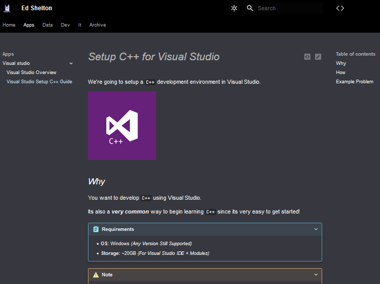

# Quick Start Guide

Let's clone this site & deploy it locally:
- `git clone https://github.com/edsheltonorg/edshelton.org.git`
- `cd edshelton.org`
- ***Python ≥ 3.9:***&nbsp; `pip install -U -r requirements.txt --user`
- `mkdocs serve`
- Open `http://localhost:8000`

You should now see a complete copy of my website:

Now, let's make it your own & setup github pages:
- Fork the code base.
- Set in repo: `Settings > Action > General > Workflow Permissions: 'Read and write permissions'`
- Adjust the `mkdocs.yml` file's site name & URL info appropriately.
- Push your first commit.
- Set in repo: `Settings > Pages > Branch: 'gh-pages'`
- You should now see `https://<your_name>.github.io/<your_repo_name>`

Last, begin sculpting it in the way you imagine: 
- Learn about [MkDocs](https://www.mkdocs.org/user-guide/configuration/)
- Learn about [MkDocs Material](https://squidfunk.github.io/mkdocs-material/setup/) **Take Time On This!**
- **Optionally**: Learn about [VSCode Foam](https://foambubble.github.io/foam/)
- **Optionally**: Set Github Pages to [custom domain](https://docs.github.com/en/pages/configuring-a-custom-domain-for-your-github-pages-site/about-custom-domains-and-github-pages) & adjust `/docs/CNAME`.

Once done, you should be comfortable ripping out all my content & building your own site!

## Why MkDocs Rocks
This system is great for a few reasons:

1. Keeps everything plaintext and under source control.
2. Easily put under CI, just edit the text, push, and edit is live!
3. Super easy to host anywhere, just copy the `./sites` artifact to any web server.
4. Fully featured fuzzy search engine.
5. [Lots of](https://squidfunk.github.io/mkdocs-material/setup/)
cool [features](https://squidfunk.github.io/mkdocs-material/reference/code-blocks/)
and lots of [plugins](https://github.com/mkdocs/catalog)
that extend `mkdocs`.

An example of the search engine, its amazingly fast and provides good context.

If you still prefer to use some other system but like my organizational strategy, keep reading.

# My Background

I took a job where ***no one had IT experience.***
  &nbsp;&nbsp;&nbsp;&nbsp;&nbsp;&nbsp;&nbsp;&nbsp;
It had **high turnover**, **no documentation**, and **dysfunctional communication!**

On top of that, ***I also became responsible for training new IT staff!***

To my surprise, I found **a deep appreciation for documenting!**

However, my personal system of tagged bookmarks wasn't going to work:

***Only 38,910 different bookmarks!***

So I began building a documentation system.

## Pitfall of Traditional Documentation

After implementing a "real" documentation system with 1500+ articles, trainees *still had issues with:*

1. The big picture.
1. Necessary background information.
1. Where to start.
1. Keeping data fresh.

These basic needs are both valuable and very tricky!

## My System

I've attempted to address these issues by breaking information into key units:

| *Unit*                                                                                   | *What*                                                                             |
| ---------------------------------------------------------------------------------------- | ---------------------------------------------------------------------------------- |
| [***Article: Context/Change***](.foam/templates/article-context-or-change.md)   | Tracking changes or background context of a subject or process.                    |
| [***Article: Glossary***](.foam/templates/article-glossary.md)                  | Explaining key terms, low-risk-of-change info, and relevant links.                 |
| [***Article: Guide***](.foam/templates/article-guide.md)                        | How to perform something, use a feature, or learn a concept.                       |
| [***Article: Issue and QA***](.foam/templates/article-issue-and-qa.md)          | Offers an alternative way to discover articles to fix issues or understand better. |
| [***Article: Procedure***](.foam/templates/article-procedure.md)                | An ordered list of manuals w/ extra business logic between to perform a process.   |
| [***Concept***](.foam/templates/concept.md)                                     | A "start here" of a concept or implementation, like "Programming" or "Python".     |

By linking these units together, you can begin building valuable & discoverable documentation.

This is roughly how I build it, with many units linked between each other in modular fashion.

## Alternative System Recommendations

You can easily adapt my templates into any platform's system!

For work, consider your team's skill level & friction tolerance:
- Microsoft OneNote (Simplest one & free if using Office 365)
- Bookstack (More advanced features, can share easier)

For personal, anything that can link will work.

Look for systems that can easily adjust links if modified & catch orphaned assets.

## Influences

The system takes working-class inspiration from Molecular Note. 
It's definitely a worthy read.
[Pt. 1](https://reasonabledeviations.com/2022/04/18/molecular-notes-part-1/)
+ [Pt. 2](https://reasonabledeviations.com/2022/06/12/molecular-notes-part-2/)

## Licenses

My templates are `CC0`.
 Please use them as you see fit.

My page content is `CC BY 4.0`.
 Just credit me, that's all!

The software used for this implementation is respectively licensed by their authors.
